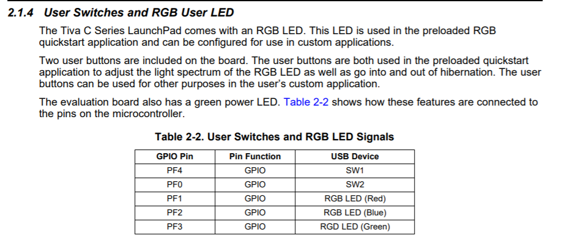

# 中断的介绍和按键的使用

1. 中断的概念
    - 什么是中断?
    - 为什么要有中断?/中断这个功能存在的意义?
2. 中断的使用
    - 构想中断的使用场景
3. 中断程序的设计(以按键为例)
    - 板子上面按键还有LED对应的引脚→原理图给出
    - 框图→如何实现这个功能?
    - 程序源码给出



## 中断的概念

## 中断的使用

## 程序设计

### 源码
```
#include <stdint.h>
#include <stdbool.h>
#include "inc/hw_types.h"
#include "inc/hw_memmap.h"
#include <inc/hw_gpio.h>
#include "driverlib/sysctl.h"
#include "driverlib/gpio.h"
#include <driverlib/rom_map.h>
#include <driverlib/rom.h>
#include <inc/hw_ints.h>
#include <driverlib/interrupt.h>
#include "driverlib/sysctl.h"

int flag;
void INT_GPIOF_Handler(void);
void vGPIO_Config_1(void);

int main(void)
{
    SysCtlClockSet(SYSCTL_SYSDIV_4|SYSCTL_USE_PLL|SYSCTL_XTAL_16MHZ|SYSCTL_OSC_MAIN);
    //system control clock set  400kHZ/(4*2)
    vGPIO_Config_1();

    GPIOPinWrite(GPIO_PORTF_BASE, GPIO_PIN_1|GPIO_PIN_2, 0XFF);   //the initial state of LED
    while(1)
        ;     //waiting for the interrupts
}


void vGPIO_Config_1(void)
{
    SysCtlPeripheralEnable(SYSCTL_PERIPH_GPIOF); //Enable a peripheral

		// -Workshop 14.2 API Fuctions
    IntEnable(INT_GPIOF); //The specified interrupt is enabled in the interrupt controller
    IntPrioritySet(INT_GPIOF,0); //Smaller numbers correspond to higher interrupt priorities; priority 0 is the highest interrupt priority.
    IntRegister(INT_GPIOF,INT_GPIOF_Handler); //Registers a function to be called when an interrupt occurs

    GPIOPinTypeGPIOOutput(GPIO_PORTF_BASE,GPIO_PIN_1 | GPIO_PIN_2 | GPIO_PIN_3 ); //Configures pins for use as GPIO outputs
    GPIODirModeSet(GPIO_PORTF_BASE,GPIO_PIN_4|GPIO_PIN_0,GPIO_DIR_MODE_IN);
    GPIOPadConfigSet(GPIO_PORTF_BASE,GPIO_PIN_0|GPIO_PIN_4,GPIO_STRENGTH_2MA,GPIO_PIN_TYPE_STD_WPU);

    GPIOIntEnable(GPIO_PORTF_BASE,GPIO_INT_PIN_4);
    GPIOIntTypeSet(GPIO_PORTF_BASE,GPIO_PIN_4,GPIO_FALLING_EDGE );
    IntMasterEnable();
}

void INT_GPIOF_Handler(void)
{
      GPIOIntClear(GPIO_PORTF_BASE, GPIO_INT_PIN_4);
        flag++;   //switch the states of the LED
        if(flag==4)
						flag=1;
        switch(flag)
        {
            case 1: GPIOPinWrite(GPIO_PORTF_BASE,GPIO_PIN_1|GPIO_PIN_2 |GPIO_PIN_3,GPIO_PIN_2 |GPIO_PIN_3); break;
            case 2: GPIOPinWrite(GPIO_PORTF_BASE,GPIO_PIN_1|GPIO_PIN_2 |GPIO_PIN_3,GPIO_PIN_1|GPIO_PIN_3); break;
            case 3:GPIOPinWrite(GPIO_PORTF_BASE,GPIO_PIN_1|GPIO_PIN_2 |GPIO_PIN_3,0XFF); break;
        }
}

```
